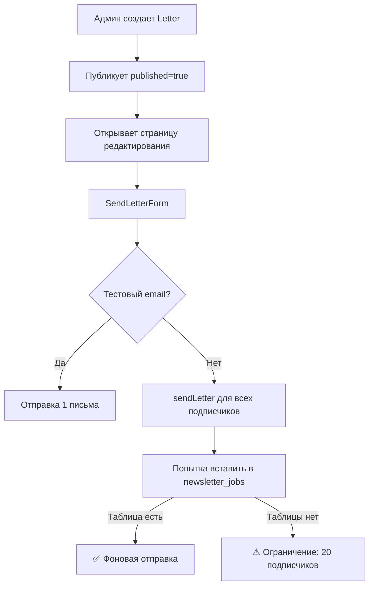

# 📧 Аудит системы рассылки

**Дата проверки:** 8 ноября 2025  
**Статус:** ⚠️ Частично настроена, требует доработки

---

## 🏗️ Архитектура системы

### База данных (Supabase)

#### Таблица `subscribers`
```sql
CREATE TABLE public.subscribers (
  id TEXT PRIMARY KEY,           -- CUID2
  email TEXT UNIQUE NOT NULL,
  "userId" TEXT REFERENCES public.users(id),
  "isActive" BOOLEAN DEFAULT false,
  "confirmedAt" TIMESTAMP,
  "unsubscribedAt" TIMESTAMP,
  wallet_address TEXT,           -- Для NFT функционала
  has_claimed BOOLEAN DEFAULT false,
  created_at TIMESTAMP DEFAULT NOW()
);
```

**RLS политики:**
- ✅ SELECT — разрешено всем (public read)
- ✅ INSERT — через authenticated users
- ⚠️ UPDATE — только через service_role (в коде)

#### Таблица `subscriber_tokens`
```sql
CREATE TABLE public.subscriber_tokens (
  id TEXT PRIMARY KEY,
  subscriber_id TEXT REFERENCES subscribers(id),
  type TEXT CHECK (type IN ('confirm', 'unsubscribe')),
  token TEXT UNIQUE NOT NULL,
  used BOOLEAN DEFAULT false,
  "usedAt" TIMESTAMP,
  created_at TIMESTAMP DEFAULT NOW()
);
```

**Назначение:**
- `confirm` — double opt-in подтверждение подписки
- `unsubscribe` — уникальная ссылка для отписки в каждом письме

#### Таблица `letters`
```sql
CREATE TABLE public.letters (
  id TEXT PRIMARY KEY,
  title TEXT NOT NULL,
  slug TEXT UNIQUE NOT NULL,
  content JSONB NOT NULL,      -- BlockEditor blocks
  published BOOLEAN DEFAULT false,
  "authorId" TEXT,
  "sentAt" TIMESTAMP,          -- Время отправки рассылки
  created_at TIMESTAMP DEFAULT NOW(),
  updated_at TIMESTAMP DEFAULT NOW()
);
```

---

## 📤 Процесс отправки рассылки

### 1. Подписка (Double Opt-in)

```mermaid
graph LR
    A[Пользователь вводит email] --> B[subscribeToNewsletter]
    B --> C[INSERT в subscribers isActive=false]
    C --> D[Генерация confirm token]
    D --> E[❌ TODO: Отправка письма]
    E --> F[Клик по ссылке]
    F --> G[/api/newsletter-confirm?token=xxx]
    G --> H[UPDATE isActive=true]
```

**Проблемы:**
- ❌ **Критично:** Письмо с подтверждением НЕ отправляется
- Строка 692 в `app/admin/actions.js`: `// TODO: send confirmation email`
- Пользователь подписывается, но не получает confirm ссылку

**Решение:**
```javascript
// В subscribeToNewsletter() после генерации confirmToken:
const resend = new Resend(process.env.RESEND_API_KEY);
await resend.emails.send({
  from: 'Anton Merkurov <noreply@merkurov.love>',
  to: email,
  subject: 'Подтвердите подписку на рассылку',
  html: `
    <p>Привет!</p>
    <p>Спасибо за интерес к моим письмам.</p>
    <p><a href="${confirmUrl}">Подтвердить подписку</a></p>
  `
});
```

### 2. Создание и отправка письма



**Проблемы:**
- ⚠️ Ограничение: отправляется максимум 20 подписчикам (строка 931)
- ❓ Таблица `newsletter_jobs` не создана
- ❓ Фоновый worker не настроен

**Код (app/admin/actions.js:877-945):**
```javascript
export async function sendLetter(prevState, formData) {
  // ... проверки ...
  
  // Попытка поставить в очередь
  const { error: jobErr } = await supabase
    .from('newsletter_jobs')
    .insert({ letter_id: letterId, status: 'pending' });
  
  if (!jobErr) {
    return { status: 'success', message: 'Письмо поставлено в очередь' };
  }
  
  // Fallback: отправка 20 подписчикам
  const { data: subs } = await supabase
    .from('subscribers')
    .select('id,email')
    .eq('isActive', true)
    .limit(20);  // ❌ Ограничение!
}
```

### 3. Отправка одному подписчику

**Файл:** `lib/newsletter/sendNewsletterToSubscriber.ts`

**Процесс:**
1. Генерация unsubscribe токена
2. INSERT токена в `subscriber_tokens`
3. Рендеринг письма через `renderNewsletterEmail()`
4. Отправка через Resend API
5. Возврат результата

**Код работает корректно ✅**

```typescript
export async function sendNewsletterToSubscriber(subscriber, letter, opts) {
  const unsubscribeToken = opts.token || createId();
  const unsubscribeUrl = `${SITE_URL}/api/newsletter-unsubscribe?token=${unsubscribeToken}`;
  
  // Insert token
  await serverSupabase
    .from('subscriber_tokens')
    .insert({ 
      subscriber_id: subscriber.id, 
      type: 'unsubscribe', 
      token: unsubscribeToken 
    });
  
  // Render email
  const emailHtml = renderNewsletterEmail(letter, unsubscribeUrl);
  
  // Send via Resend
  const resend = new Resend(process.env.RESEND_API_KEY);
  const resp = await resend.emails.send({
    from: 'Anton Merkurov <noreply@merkurov.love>',
    to: subscriber.email,
    subject: letter.title,
    html: emailHtml
  });
  
  return { status: 'sent', providerResponse: resp };
}
```

---

## 🎨 Email шаблон

**Файл:** `emails/NewsletterEmail.jsx`

**Возможности:**
- ✅ Конвертация BlockEditor блоков в HTML
- ✅ Автоматический ресайз Supabase изображений
- ✅ Поддержка всех типов блоков (richText, gallery, columns, quote, code, video)
- ✅ Sanitize ссылок внутри HTML
- ✅ Unsubscribe ссылка в футере

**Типы блоков:**
```javascript
const blockTypes = [
  'richText',   // HTML content
  'image',      // Single image
  'gallery',    // Multiple images
  'columns',    // Multi-column layout
  'quote',      // Blockquote
  'code',       // Code snippet
  'video',      // Video link
  'paragraph',  // Editor.js compatibility
  'link'        // Editor.js link tool
];
```

**Функция ресайза изображений:**
```javascript
function addResizeToSupabaseImages(html, width = 600, quality = 70) {
  return html.replace(
    /]+src=["'])(https:\/\/[^"'>]*supabase\.co\/+storage[^"'>]*)(["'][^>]*)>/g,
    (match, before, url, after) => {
      return ``;
    }
  );
}
```

---

## 🔧 API Endpoints

### `/api/newsletter-confirm` (GET)
**Назначение:** Подтверждение подписки (double opt-in)

```typescript
GET /api/newsletter-confirm?token=cuid2_xxx
```

**Процесс:**
1. Проверка токена в `subscriber_tokens` (type='confirm', used=false)
2. Пометить токен как использованный
3. UPDATE `subscribers.isActive = true, confirmedAt = NOW()`
4. Возврат успеха

**Статус:** ✅ Работает

### `/api/newsletter-unsubscribe` (GET)
**Назначение:** Отписка от рассылки

```typescript
GET /api/newsletter-unsubscribe?token=cuid2_xxx
```

**Процесс:**
1. Проверка токена (type='unsubscribe', used=false)
2. Пометить токен как использованный
3. UPDATE `subscribers.isActive = false, unsubscribedAt = NOW()`
4. Возврат успеха

**Статус:** ✅ Работает

---

## ⚙️ Конфигурация (Environment Variables)

### Обязательные переменные:

```bash
# Supabase (уже настроены)
NEXT_PUBLIC_SUPABASE_URL=https://txvkqcitalfbjytmnawq.supabase.co
NEXT_PUBLIC_SUPABASE_ANON_KEY=eyJhbGciOiJIUzI1NiIsInR5cCI6IkpXVCJ9...
SUPABASE_SERVICE_ROLE_KEY=eyJhbGciOiJIUzI1NiIsInR5cCI6IkpXVCJ9...

# Resend (требуется добавить в production)
RESEND_API_KEY=re_dEqvvLFs_NqnWPygBdLHKL8WjLG9htyBu
NOREPLY_EMAIL=noreply@merkurov.love
NOREPLY_DISPLAY=Anton Merkurov

# Site URL (для ссылок в письмах)
NEXT_PUBLIC_SITE_URL=https://merkurov.love
```

### Добавление в production (Vercel):

```bash
vercel env add RESEND_API_KEY production
# Вставить: re_dEqvvLFs_NqnWPygBdLHKL8WjLG9htyBu

vercel env add NOREPLY_EMAIL production
# Вставить: noreply@merkurov.love

vercel env add NOREPLY_DISPLAY production
# Вставить: Anton Merkurov
```

---

## 🐛 Найденные проблемы

### 🔴 Критичные:

1. **Отсутствует отправка confirmation email** (строка 692, `app/admin/actions.js`)
   - Пользователь подписывается → не получает письмо с подтверждением
   - Решение: добавить `resend.emails.send()` после генерации confirmToken

2. **Ограничение на 20 подписчиков** (строка 931, `app/admin/actions.js`)
   - При отправке рассылки обрабатывается только 20 подписчиков
   - Решение: создать таблицу `newsletter_jobs` и фоновый worker

### ⚠️ Важные:

3. **Отсутствует таблица `newsletter_jobs`**
   - Нет механизма фоновой обработки массовых рассылок
   - Решение: создать миграцию + worker

4. **Нет индикатора прогресса отправки**
   - Админ не видит сколько писем отправлено
   - Решение: таблица `newsletter_logs` + real-time UI

5. **Отсутствует rate limiting**
   - Resend API имеет лимиты (зависит от тарифа)
   - Решение: батчинг с задержками

### 💡 Улучшения:

6. **Нет аналитики открытий/кликов**
   - Не видно кто открыл письмо, по каким ссылкам кликнул
   - Решение: tracking pixels + UTM параметры

7. **Нет preview письма перед отправкой**
   - Админ может отправить письмо с ошибками
   - Решение: `/api/admin/letters/test-render` используется, но нет превью в UI

8. **Нет шаблонов писем**
   - Каждое письмо создается с нуля
   - Решение: таблица `letter_templates` с presets

---

## ✅ Что работает правильно

1. ✅ Double opt-in архитектура (confirm/unsubscribe токены)
2. ✅ Email шаблон с правильным рендерингом блоков
3. ✅ Автоматический ресайз Supabase изображений
4. ✅ Unsubscribe ссылки уникальны для каждого письма
5. ✅ Тестовая отправка на один email
6. ✅ Resend API интеграция
7. ✅ Синхронизация `subscribers` ↔ `users.is_subscribed`
8. ✅ RLS политики на таблицах

---

## 🚀 План действий

### Срочно (0-2 дня):

- [ ] **Добавить отправку confirmation email** в `subscribeToNewsletter()`
- [ ] **Поднять лимит с 20 до 100** подписчиков временно
- [ ] **Добавить `RESEND_API_KEY` в Vercel env**
- [ ] **Протестировать полный цикл подписки**

### Важно (3-7 дней):

- [ ] **Создать таблицу `newsletter_jobs`:**
  ```sql
  CREATE TABLE newsletter_jobs (
    id TEXT PRIMARY KEY,
    letter_id TEXT REFERENCES letters(id),
    status TEXT CHECK (status IN ('pending', 'processing', 'completed', 'failed')),
    total_count INT,
    sent_count INT DEFAULT 0,
    failed_count INT DEFAULT 0,
    created_at TIMESTAMP DEFAULT NOW(),
    started_at TIMESTAMP,
    completed_at TIMESTAMP
  );
  ```

- [ ] **Создать фоновый worker** (API Route + cron)
  - `/api/cron/newsletter-worker` (проверка каждую минуту)
  - Обработка батчами по 10-50 писем
  - Задержка между батчами 1-2 секунды

- [ ] **Добавить таблицу логов:**
  ```sql
  CREATE TABLE newsletter_logs (
    id TEXT PRIMARY KEY,
    job_id TEXT REFERENCES newsletter_jobs(id),
    subscriber_id TEXT REFERENCES subscribers(id),
    status TEXT CHECK (status IN ('sent', 'failed', 'bounced')),
    error TEXT,
    provider_id TEXT,  -- Resend email ID
    sent_at TIMESTAMP DEFAULT NOW()
  );
  ```

### Улучшения (1-2 недели):

- [ ] **Preview UI** для писем перед отправкой
- [ ] **Analytics:**
  - Tracking pixel для открытий
  - UTM параметры в ссылках
  - Dashboard с метриками
- [ ] **Шаблоны писем** (готовые layouts)
- [ ] **Segmentation:** отправка по тегам/группам

---

## 📊 Текущие метрики

**Подписчики:** Нужно проверить в БД
```sql
SELECT 
  COUNT(*) FILTER (WHERE "isActive" = true) as active,
  COUNT(*) FILTER (WHERE "isActive" = false AND "confirmedAt" IS NULL) as pending,
  COUNT(*) FILTER (WHERE "unsubscribedAt" IS NOT NULL) as unsubscribed,
  COUNT(*) as total
FROM public.subscribers;
```

**Письма:**
```sql
SELECT 
  COUNT(*) FILTER (WHERE published = true) as published,
  COUNT(*) FILTER (WHERE "sentAt" IS NOT NULL) as sent,
  COUNT(*) as total
FROM public.letters;
```

---

## 🔒 Безопасность

✅ **Что сделано правильно:**
- Токены генерируются через `createId()` (CUID2) — криптостойкие
- RLS включен на всех таблицах
- Service role используется только server-side
- Unsubscribe токены уникальны и одноразовые

⚠️ **Потенциальные риски:**
- Нет rate limiting на `/api/newsletter-confirm` (можно спамить)
- Токены не истекают (нет expiry time)
- Нет защиты от email spoofing (SPF/DKIM настроены?)

---

## 📝 Примеры использования

### Подписка пользователя:

```javascript
// Форма подписки (компонент уже есть)
<NewsletterModal />

// Server action
const result = await subscribeToNewsletter(null, formData);
// Результат: { status: 'success', message: 'Проверьте почту' }
```

### Отправка письма:

```javascript
// Из админки (/admin/letters/edit/[id])
<SendLetterForm letter={letter} />

// Тестовая отправка
<input name="testEmail" value="test@example.com" />
// Результат: письмо на test@example.com, БЕЗ вставки токена

// Массовая отправка
// Результат: максимум 20 писем (временное ограничение)
```

### API проверки статуса:

```typescript
// GET /api/subscription-status
const response = await fetch('/api/subscription-status');
const { isSubscribed } = await response.json();
```

---

## 🎯 Заключение

**Общая оценка:** 6/10

**Сильные стороны:**
- Архитектура продумана правильно (double opt-in, unique unsubscribe)
- Email рендеринг работает отлично
- Код чистый и понятный
- Интеграция с Resend корректная

**Слабые стороны:**
- **Критично:** Не отправляется confirmation email
- Ограничение на 20 подписчиков
- Нет фоновой обработки больших рассылок
- Отсутствует аналитика

**Готовность к production:** 60%

Для полноценного запуска нужно:
1. Исправить отправку confirmation email (1 час)
2. Добавить env переменные в Vercel (10 минут)
3. Протестировать полный цикл (1 час)

Для масштабирования (>100 подписчиков):
4. Создать newsletter_jobs таблицу (30 минут)
5. Написать worker (2-3 часа)
6. Добавить логирование (1 час)
